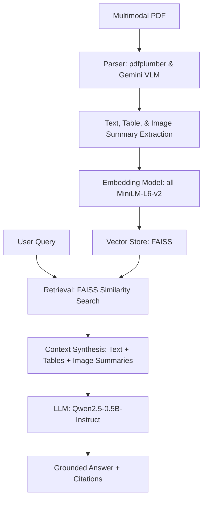

# Automotive Ergonomics Multimodal RAG System

## 1. Problem Statement
### Domain Identification: Automotive Ergonomics and Design Engineering
The automotive industry is currently undergoing a rapid transformation, driven by advancements in autonomous driving, electric powertrains, and human-centric design. At the core of this evolution is **Automotive Ergonomics**, a multidisciplinary field that ensures vehicles are safe, comfortable, and intuitive for a diverse range of users. Design engineers must navigate a vast sea of technical documentation, including international safety standards (e.g., ISO, SAE), internal design catalogs, anthropometric data tables, and complex interior diagrams.

### The Problem: Fragmented Multimodal Data
The primary challenge in automotive ergonomics is the fragmented nature of critical information across different modalities. A single ergonomic requirement, such as the "driver's reach zone," is typically described across three distinct data types:
1.  **Textual Descriptions:** Detailed safety regulations explaining the qualitative aspects of reach and visibility.
2.  **Tabular Data:** Extensive anthropometric tables providing percentile-based measurements (5th percentile female to 95th percentile male).
3.  **Visual Diagrams:** CAD-derived interior layouts showing H-point locations, eye ellipses, and control placement.

Currently, design engineers must manually cross-reference these sources. An engineer might find a textual requirement for "clearance" in a safety manual, then have to search a separate technical catalog for the corresponding measurement table, and finally verify the spatial context using a 2D interior diagram. This manual "mental stitching" of multimodal data is not only time-consuming but also highly prone to human error, which can lead to costly design revisions or, worse, safety non-compliance.

### Uniqueness and Domain-Specific Challenges
Automotive ergonomics presents unique challenges for standard information retrieval systems:
*   **Precision is Mandatory:** Unlike general-purpose AI, an ergonomic RAG system cannot "hallucinate" measurements. A 5mm error in seat-track positioning can invalidate a vehicle's safety rating.
*   **Table-Heavy Documentation:** Most "source of truth" data exists in dense, nested tables that traditional OCR-based systems often flatten into meaningless text strings.
*   **Spatial Reasoning:** Ingesting a diagram requires understanding the spatial relationship between components (e.g., steering wheel vs. instrument cluster), not just identifying that an "image" exists.

### Justification for Multimodal RAG
Retrieval-Augmented Generation (RAG) is the ideal solution for this problem for several reasons:
*   **Grounding and Hallucination Mitigation:** By forcing the LLM to provide answers based only on the retrieved technical documents, we ensure that the generated ergonomics advice is grounded in actual engineering standards.
*   **Multimodal Synthesis:** A multimodal RAG system can "read" a table, "see" a diagram, and "summarize" a text paragraph in a single query cycle. It automates the "mental stitching" that engineers currently do manually.
*   **Dynamic Knowledge Base:** Unlike a fine-tuned model, a RAG system can be updated instantly by adding new PDF catalogs to the ingestion pipeline without retraining the underlying model.

### Expected Outcomes
The implementation of this system aims to:
*   Reduce the time spent on ergonomic data lookup by over 70%.
*   Provide high-accuracy, grounded answers to complex queries like "What is the recommended clearance for a 95th percentile male driver in a compact SUV cabin based on the latest internal specs?"
*   Support multimodal queries where the answer requires synthesizing data from a table (measurements) and an image (spatial layout).

---

## 2. Architecture Overview



---

## 3. Technology Choices
*   **Parser (pdfplumber):** Chosen for its superior ability to extract structured table data compared to standard PyPDF2. It preserves the spatial coordinates of table cells, which is critical for ergonomic measurements.
*   **VLM (Gemini 1.5 Flash):** Used during the ingestion phase to generate high-quality text summaries of interior diagrams and complex charts. These summaries are then indexed as searchable text.
*   **Embedding Model (sentence-transformers/all-MiniLM-L6-v2):** A lightweight yet powerful model that provides a good balance between retrieval accuracy and low latency on resource-constrained environments (8GB RAM).
*   **Vector Store (FAISS):** The industry standard for efficient similarity search. It allows for rapid retrieval of relevant document chunks.
*   **LLM (Qwen2.5-0.5B-Instruct):** A state-of-the-art small language model. It was selected because it can run locally on 8GB RAM while maintaining high instruction-following capabilities for technical synthesis.

---

## 4. Setup Instructions

### Prerequisites
- Python 3.9+
- 8GB RAM (Minimum)
- Gemini API Key (for VLM-based ingestion)

### Step-by-Step Installation
1.  **Clone the Repository:**
    ```bash
    git clone https://github.com/AnoopGodara/Multimodel_RAG_Bootcamp.git
    cd Multimodel_RAG_Bootcamp
    ```

2.  **Set up Virtual Environment:**
    ```bash
    python -m venv venv
    source venv/bin/activate  # On Windows: venv\Scripts\activate
    ```

3.  **Install Dependencies:**
    ```bash
    pip install -r requirements.txt
    ```

4.  **Configure Environment Variables:**
    Create a `.env` file in the root directory:
    ```env
    GEMINI_API_KEY=your_api_key_here
    ```

5.  **Run the Application:**
    ```bash
    python main.py
    ```
    The API will be available at `http://localhost:8000`.

---

## 5. API Documentation

### POST `/ingest`
Uploads and processes a multimodal PDF.
- **Request:** `multipart/form-data` with `file=@your_document.pdf`
- **Sample Response:**
```json
{
  "status": "success",
  "chunks_added": 42
}
```

### POST `/query`
Submits a natural language query to the RAG system.
- **Sample Request:**
```json
{
  "query": "What are the key ergonomic considerations for driver seat adjustment?",
  "k": 4
}
```
- **Sample Response:**
```json
{
  "answer": "Based on the provided documents, driver seat adjustment should prioritize visibility and reach. Key considerations include the H-point location for eye-line alignment and the fore-aft adjustment range to accommodate percentiles ranging from 5th to 95th.",
  "citations": [
    {
      "source": "Ergonomics_Manual.pdf",
      "page": 12,
      "type": "text"
    },
    {
      "source": "Ergonomics_Manual.pdf",
      "page": 15,
      "type": "table"
    }
  ]
}
```

### GET `/health`
Returns system status and index statistics.
- **Sample Response:**
```json
{
  "status": "healthy",
  "resources": {
    "cpu": "15%",
    "memory": "65%"
  },
  "index_size": 156
}
```

---

## 6. Screenshots
Evidence of the working system, including Swagger UI and multimodal query results, can be found in the `Screenshot/` directory.

---

## 7. Limitations & Future Work
*   **Local LLM Size:** The current system uses a 0.5B parameter model to fit within 8GB RAM. While efficient, a larger model (7B+) would improve complex reasoning.
*   **PDF Complexity:** Extremely complex nested tables may still require manual verification.
*   **Future Work:** 
    *   Implementing a Cross-Encoder Re-ranker for improved retrieval precision.
    *   Adding support for direct CAD file ingestion (STEP/IGES).
    *   Developing a specialized "Safety Compliance Checker" agent.
